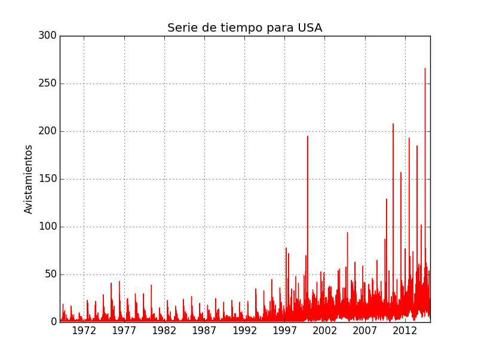

Métodos de Gran Escala - Proyecto 1
========================================================
author: Alfonso Kim
date: 03 03 2015

Generación de Instancias en Amazon
=======================================================
type: sub-section

Amazon EC2
========================================================

_create_aws_instances.sh_ : script que genera las instancias de AWS para bajar los datos

<small>
- `image-id ami-29ebb519`: AMI con Ubuntu Server
- `count 3`: 3 instancias
- `instance-type t2.micro`: El tipo de maquina gratiuta
- `security-groups launch-wizard-1`: Este grupo de seguridad tiene abierto el puerto 22 al mundo
- `key aws-akim`: Par de llaves para la autenticacion
- `output json`: Salida del comando en JSON para facilitar encontrar el ID de las nuevas maquinas
</small>

Amazon EC2
========================================================

- _get_instances_id.py_ : Pequeño script de Python que obtiene los identificadores de las instancias recién generadas y crea un archivo _instancias_aws_ que contiene los identificadores

- _create_parallel_instances_file.sh_ Crea el archivo de instancias para la ejecución de parallel. Llama al comando _describe-instances- de AWS CLI para obtener el JSON de las instnacias y recuperar su IP pública, además formatea las líneas necesarias para la conexión SSL

- _aws_setup.sh_ Aprovisiona las instancias de AWS con los paquetes necesarios para bajar los datos

- _setup_aws_instances.sh_ Levanta el flujo de creación y aprovisionamiento de instancias AWS

Adquisición de Datos
========================================================
type: sub-section

Scrappy
========================================================

Librería de Python para "scrappear" datos. Administra
"spiders" para navegar entre las ligas HTML y obtener los datos

El scrapper se encuentra en la carpeta `nuforc` del proyecto

- _run_scrappy.sh_: Invoca el scrapper y genera un archivo data.csv separado por pipes

Scrappy
========================================================

Expresiones XPATH para la localización de datos en el DOM:
- `//*/td[1]/*/a[contains(@href, "ndxe")]`: Encuentra las ligas a los avistamiientos por mes
- `//table/tbody/tr`: Encuentra cada renglón del reporte de cada mes
- `//table/tbody/tr[2]/td//text()`: Encuentra la descripción completa de cada reporte, no sólo el resumen

Al final no fue necesario usar las instancias de AWS para bajar los datos, ya que tardaron poco (30~40 mintos) localmente

Procesamiento de datos
========================================================
type: sub-section


Avistamientos totales
========================================================

`wc -l data.csv | grep -o '[0-9]*'`
Simplemente hace un conteo de avistamientos descargados

Top 5 estados
========================================================

`cut -d$'|' -f3 data.csv | grep -Eo '[A-Z]{2}' | grep -Ev 'NA' | sort | uniq -c | sort -r | head -5`

- Se obtiene la tercera columna (Estado) de los que si tienen valor (No 'NA') y se ordenan usando librerías estándar de unix.

Top 5 estados por año
========================================================

`cut -d$'|' -f1,3 data.csv | awk -f states_by_year.awk | sort -t "|" -k 1,1 -k 2,2 | uniq -c | sort -r `

- Casi lo mismo que el problema anterior, sólo se ordena por año,país y se procesa mediante AWK

```
match($0, /([0-9][0-9]?)\/([0-9][0-9]?)\/([0-9][0-9])( *)([0-9:]*)\|([A-Z]{2})/, grp){
    m = 1;
    print grp[3] "|" grp[6]
};
```

Rachas
========================================================

Las rachas fueron un poco más complicadas, el procesamiento de fechas
se hizo en Python, aunque se pudo haber hecho alguna parte en AWK.


Rachas
========================================================

_state-streaks.py_: Detecta las rachas para un estado o para todo el
país si no se usa ningún argumento al llamarlo.
<small>
Fragmento:
```{python, eval=FALSE}
def build_streaks(dates):
    dates.sort()
    streaks = []
    begin = dates[0]
    end = dates[0]
    for current in dates[1:]:
        delta = current - end
        if delta.days == 1: # Sigue la racha
            end = current
        else:       # Fin de la racha
            if (end - begin).days > 1: 
                streaks.append((begin, end, (end - begin).days))
            begin = current
            end = begin
    return sorted(streaks, key=lambda x: -x[2])
```
</small>


Rachas
========================================================

- _streaks.sh_: Invoca al script de python. Se puede pasar un estado como argumento, si no se pasa entonces se calcula para todo el país:

```
./streaks.sh 
16/06/94-23/06/94: 7
```

```
./streaks.sh WA
14/01/14-20/01/14: 5
```

Conteos Agregados
========================================================

De igual forma se hizo un script de python para el procesamiento de las fechas.

No se hizo completamente en AWK por que, hasta mi entendimiento, GAWK (el mejor AWK) no tiene una función de parsear fechas (aunque sí para formatearlas). Hay que hacer uso de expresiones regulares y aritmética, lo que complicaba un poco la extracción de día de la semana.

Conteos Agregados
========================================================

<small>
Fragmento
```{python, eval=FALSE}
    if header: sys.stdin.readline() 
    line = sys.stdin.readline()
    unit_counter = {}
    while line:
        data = line.strip().split('|')
        date = safe_parse_date(data[0])
        if date:
            unit = TIME_UNITS[time_unit][0](date)
            if unit in unit_counter:
                unit_counter[unit] += 1
            else:
                unit_counter[unit] = 1
        line = sys.stdin.readline()
    for key in sorted(unit_counter, key=unit_counter.get, reverse=True):
        print '%s: %s' % (TIME_UNITS[time_unit][1](key), unit_counter[key])
```
</small>


Conteos Agregados
========================================================

- _count.sh_ Invoca al script de conteos, se puede pasar como argumento una unidad de tiempo sobre la cual agregar:

```
./counts.sh year
2014: 8490
```

```
./counts.sh dow
Sat: 16931
```

```
./counts.sh hour
21: 13550
```

<small>Por defecto es el mes</small>
```
./counts.sh 
Jul: 11540
```

Series de Tiempo
========================================================
type: sub-section

Series de tiempo
========================================================
Las series de tiempo se calcularon casi igual que las rachas, se procesan 
los datos de la entrada estándar y se fue formando el diccionario de
avistamientos identificado por la fecha.

Hay avistamientos con fecha en el futuro, esos no se contemplaron
para la generación de la serie.


Series de tiempo
========================================================

Se usó la librería matplotlib.pyplot para graficar una serie de tiempo
simple:




Siguientes Pasos
========================================================
type: sub-section

Siguientes Pasos
========================================================

Hay muchas mejoras que se pueden hacer en el estado actual del proyecto:

- Ordenar los scripts, está todo revuelto en la misma carpeta

- En los scripts de python hay muchos métodos duplicados, se puede hacer un script estilo librería para que se use en los demás scripts

- O mejor, los scripts de python se pueden reemplazar por gawk puro


Conclusiones
========================================================
type: sub-section

Conclusiones
========================================================

Este proyecto fue muy entretenido e ilustrativo para conocer el flujo de adquisición y procesamiento un tanto "superficial" de los datos, siempre y cuando sean manejables en memoria. 

Se solificó el conocimiento de las herramientas de linux para procesamiento de texto y las herramientas de AWS para generar servidores desde línea de comandos
