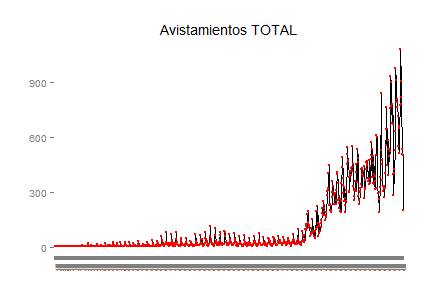
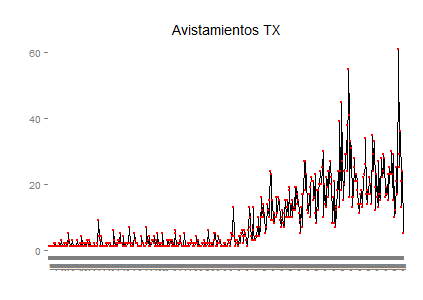
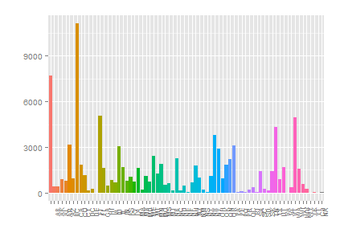
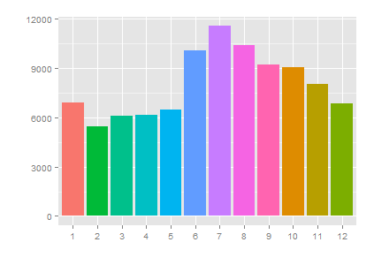
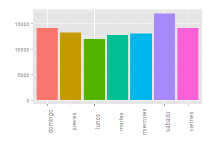
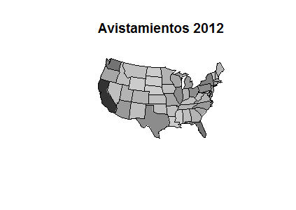

Métodos de Gran Escala Proyecto 1
========================================================
author: Amanda Balderas Mendoza
date: Marzo 2015


Lista url´s
========================================================

Apoyandonos de `R`, vamos a genrar las lista de url's que se utilizará para descargar las tablas con la información de avistamientos.

El script utilizado para el obtener la lista de url´s es `lista_urls.r`.

Para ejecutar este script usamos el siguiente código:

```
./lista_urls.r 
```


Lista url´s
========================================================

Para utilizar la lista de urls, le haremos una limpieza al archivo:

1. Eliminasmos las dobles comillas
2. Eliminamos la primera línea
3. Eliminamos la segunda línea
4. Seleccionamos la columna correspondiente a las url's
5. guardamos nuestro archivo limpio

Tenemos el siguiente código:

```
cat UFO_urls.txt |sed 's/"//g' | sed '1d' | sed '/./!d' | cut -f2 > UFO_urls1.txt
```


Scrapping y Data Frame
========================================================

El script de `R` utilizado para el descargar los datos de avistamientos, nos permite guardar la información por mes e ir generando el Data Frame con todos los registros que se van descargando, este script corresponde al archivo `scrapping.r`.

Para ejecutar este script en paralelo usamos el siguiente código:

```
cat UFO1_urls.txt | ~/bin/parallel -N300 --pipe --sshlogin : "./scrapping_ufo.r" | ./scrapping.r
```


Scrapping y Data Frame
========================================================

Para realizar lo anterior pero con máquinas remotas sustituiríamos en el código `--sshlogin` por `-slf intancias`, donde instancias corresponde al archivo con la dirección de las instancias que se van a correr.


Generando gráficas
========================================================

El script de `R` utilizado para generar las gráficas de las series de tiempo corresponde al archivo `graficas_ufo.r`.

El script nos permite obtener gráficas de las series de tiempo del número de avistamientos para el total o por estado.

Para especificar los datos que serán utilizados y la gráfica que queremos obtener utilizamos el archivo `datos_grafica.txt`

Para ejecutar este script usamos el siguiente código:

```
cat datos_grafica.txt | ./grafica_ufo.r
```


Serie de tiempo total
========================================================

Tenemos la serie historica del total de avistamientos para el periodo Jun.-1400 a Feb.-2015.

Se puede destacar que el máximo número de avistamientos que se ha observado se dio en Jul.-2014




Serie de tiempo por estado
========================================================

Tenemos como ejemplo la serie historica del total de avistamientos para el estado de xxx en el periodo Jun.-1400 a Feb.-2015.

Se puede destacar que el máximo número de avistamientos que se ha observado para este estado se dio en Jul.-2014




Avistamientos totales
========================================================

¿Cuántas observaciones totales?

Para obtener el total de observaciones utilizamos el siguiente código, debemos considerar no contar la línea de encabezados:

Tenemos el siguiente código:

```
cat datos_UFO.txt | sed '1d' | wc -l
```

Para el periodo descargado tenemos un total de **96,109** observaciones.


Top 5 de estados
========================================================

¿Cuál es el top 5 de estados?

Para obtener el top 5 general de estados utilizamos el siguiente código:

1. Eliminamos los encabezados
2. Seleccionamos la columna que corresponde a `State`
3. Sustituimos los casos con NA por vacios
4. Eliminamos las comillas
5. Elimimamos todos los casos que quedan vacios
6. Ordenamos


Top 5 de estados
========================================================

7. Contamos los valores unicos
8. Ordenamos los conteos
9. Observamos los primeros 5

Tenemos el siguiente código:

```
cat datos_UFO.txt | sed '1d' | cut -f12 | sed '/NA/d' | sed 's/"//g' | sed '/./!d' | sort | uniq -c | sort -nr | head -5
```


Top 5 de estados
========================================================

Resultado:

```
  11124 CA -- California
   5057 FL -- Florida
   4968 WA -- Washington
   4326 TX -- Texas
   3808 NY -- Nueva York
```


Top 5 de estados
========================================================

Gráfica del número de avistamientos por estado.




Top 5 de estados por año
========================================================

¿Cuál es el top 5 de estados por año?

Para obtener el conteo de avistamientos por año seguimos los siguientes pasos:

1. Eliminamos los encabezados
2. Seleccionamos las columnas que corresponden a `anio` y `State`
3. Eliminados las lineas que tengan NA
4. Eliminamos las lineas que tengas dobles comillas
5. Eliminamos las comillas


Top 5 de estados por año
========================================================

6. Ordenamos por el año
7. Contamos los valores unicos

Tenemos el siguiente código:

```
cat datos_UFO.txt | sed '1d' | cut -f2,12 | sed '/NA/d' | sed '/""/d' | sed 's/"//g' | sort -k1,2 | uniq -c > cta_anio_sta.txt
```


Top 5 de estados por año
========================================================

Para obtener el top 5 para algún estado en particular utilizamos los conteos por año y estado obtenidos anteriormente y realiazamos los siguientes pasos:

1. Seleccionamos las observaciones del año que deseamos consultar
2. Ordenamos los conteos
3. Observamos los primeros 5 del año seleccionado

Tenemos el código siguiente:

```
cat cta_anio_sta.txt | grep '2014' | sort -k1r | head -5
```


Top 5 de estados por año
========================================================

Resultado para el ejemplo del año 2014:

``` 
  857 2014    CA -- California
  631 2014    FL -- Florida
  376 2014    PA -- Pensilvania
  365 2014    WA -- Washington
  316 2014    NY -- Nueva York
```


Racha más larga en un estado
========================================================

¿Cuál se la racha más larga en días de avistamientos en un estado?

Para obtener la racha de un estado en particular utilizaremos la columna de fecha creada al ir descargando y guardando los datos.

Seguimos los pasos:

1. Eliminamos la primera línea
2. Seleccionamos las columnas que corresponden a `fecha` y `State`
3. Seleccionamos los registros del estado que queremos consultar


Racha más larga en un estado
========================================================

4. Ordenamos por fecha
5. Seleccionamos los registros únicos
6. Utilizando `awk` vamos registrando las diferentes rachas de avistamientos
7. Seleccionamos la columna con las rachas obtenidas
8. Eliminamos vacíos
9. Ordenamos
10. Observamos las tres rachas más largas


Racha más larga en un estado
========================================================

Tenemos el siguiente código:

```
cat datos_UFO.txt | sed '1d' | cut -f9,12 | grep 'CA' | sort -n | uniq | awk '{if(x==""){x = $1}; if(x!=1){$3=$1-x; x=$1}} {print $1, $3}'| awk '{if(y==""){y=1}; if($2==1){y+=1}; if($2!=1){$3=y; y=1}} {print $1, $2, $3}' | cut -d$' ' -f3 | sed '/./!d' | sort -nr | head -3
```

Resultado de las rachas más largas para el estado 'CA' -- California:

```
42
31
30
```

Racha más larga en el país
========================================================

¿Cuál se la racha más larga en días de avistamientos en el país?

Para obtener la racha general de USA seguimos los pasos:

1. Eliminamos la primera línea
2. Seleccionamos la columnas 9 que corresponde a `fecha`
3. Ordenamos por fecha
4. Seleccionamos los registros únicos
5. Utilizando `awk` vamos registrando las diferentes rachas de avistamientos
6. Seleccionamos la columna con las rachas obtenidas


Racha más larga en el país
========================================================

7. Eliminamos vacíos
8. Ordenamos
9. Observamos las tres rachas más largas

Tenemos el siguiente código:

```
cat datos_UFO.txt | sed '1d' | cut -f9 | sed 's/"//g' | sort -n | uniq | awk '{if(x==""){x = $1}; if(x!=1){$2=$1-x; x=$1}} {print $1, $2}'| awk '{if(y==""){y=1}; if($2==1){y+=1}; if($2!=1){$3=y; y=1}} {print $1, $2, $3}' | cut -d$' ' -f3 | sed '/./!d' | sort -nr | head -3
```


Racha más larga en el país
========================================================

Resultado de las rachas de avistamientos más largas en días para USA:

```
640
384
184
```

Mes con más avistamiento
========================================================

¿Cuál es el mes con más avistamientos? 

Tenemos que, considerando todos los avistamientos observados, ha sido julio el mes con más número de avistamientos en total.

Para obtener esta información tenemos los pasos siguientes:

1. Eliminamos la primera línea
2. Seleccionamos la columna correspondiente a mes
3. Eliminamos las comillas dobles
4. Eliminamos los ceros al inicio del número de mes


Mes con más avistamiento
========================================================

5. Ordenamos
6. Contamos valores únicos
7. Ordemanos para observar los meses con más avistamientos

Tenemos el siguiente código:

```
cat datos_UFO.txt | sed '1d' | cut -f3 | sed 's/"//g' | sed 's/^0//' | sort | uniq -c | sort -nr
```

Mes con más avistamiento
========================================================

Tenenos el siguiente resultado, donde se puede ver que _Julio_ es ha sido el mes con más avistamientos.

```
  11540 7 -- Julio
  10406 8 -- Agosto
  10061 6 -- Junio
   9212 9 -- septiembre
   9024 10 -- Octubre
   8025 11 -- Noviembre
   6919 1  -- Enero
   6824 12 -- Diciembre
   6440 5  -- Mayo
   6154 4  -- Abril
   6072 3  -- Marzo
   5432 2  -- Febrero
```

Mes con más avistamiento
========================================================

Gráfica del total de avistamientos por mes.




Día con más avistamientos 
========================================================

¿Cuál es el día con más avistamientos?  

Tenemos que, considerando todos los avistamientos observados, ha sido el día _Sábado_ el día con más avistamientos.

Seguimos estos pasos:

1. Eliminamos la primera línea
2. Seleccionamos la columna correspondiente a día de la semana (que se obtuvo al ir descargando los datos)
3. Eliminamos las comillas dobles
4. Ordenamos


Día con más avistamientos 
========================================================

5. Contamos los registros únicos
6. Ordenamos el conteo de mayor a menor

Tenemos el siguiente código:

```
cat datos_UFO.txt | sed '1d' | cut -f8 | sed 's/"//g' | sort | uniq -c | sort -nr 
```


Día con más avistamientos 
========================================================

El resultado obtenido es:

```
  16942 sabado
  14133 domingo
  14088 viernes
  13226 jueves
  13036 miercoles
  12710 martes
  11974 lunes
```


Día con más avistamientos 
========================================================

Gráfica del total de avistamientos por día.




Mapas de avistamientos por año para Estados Unidos 
========================================================

El código en `R` utilizado para obtener los mapas, se encuentra en el archivo `mapas.r`.

Los mapas nos muestran a nivel de estado como varia el número de avistamientos en el país, se presenta en escala de grises, donde gris más claro representa menos avistamientos, mientras que gris más obscuro corresponde a un mayor número de avistamientos.


Mapa 2010 
========================================================


Mapa 2011
========================================================


Mapa 2012
========================================================





Mapa 2013
========================================================


Mapa 2014
========================================================


