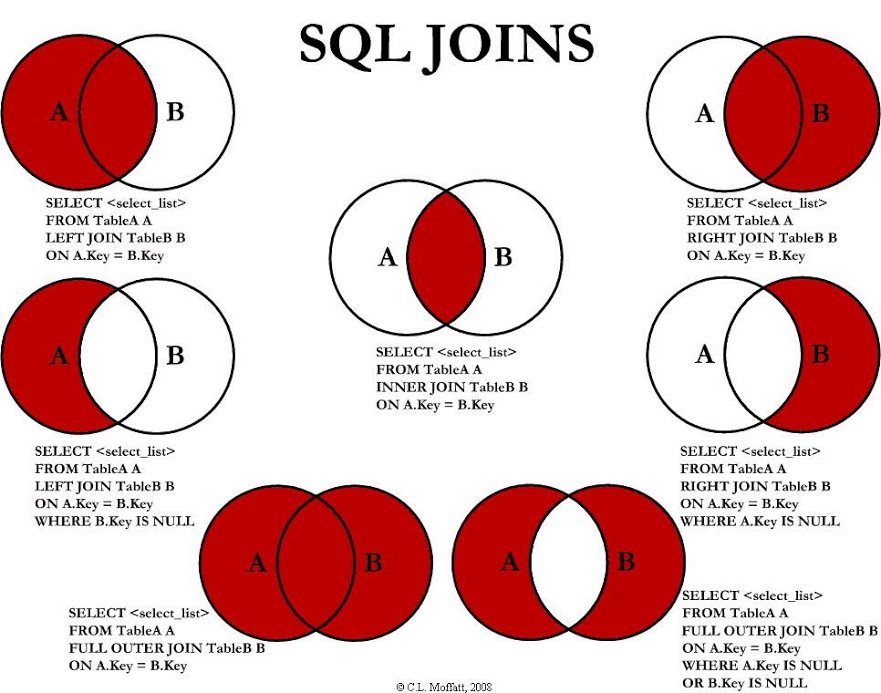
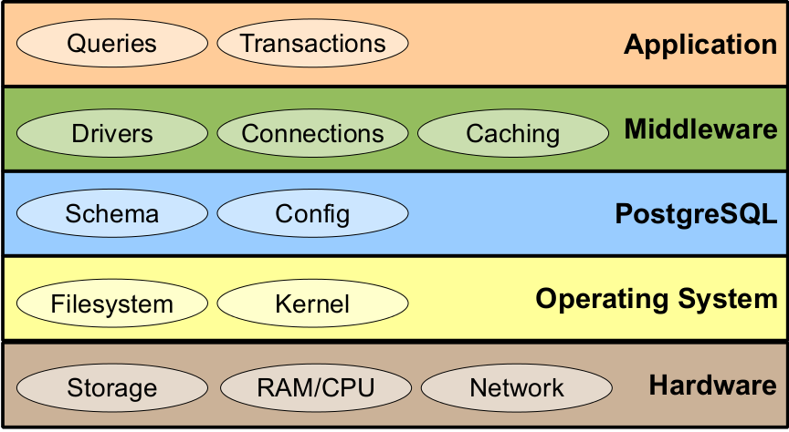
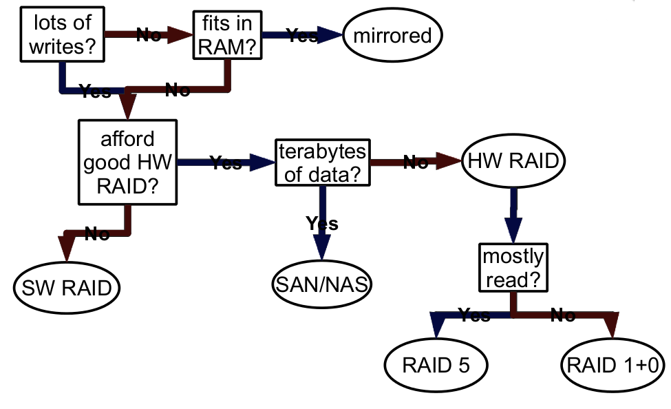
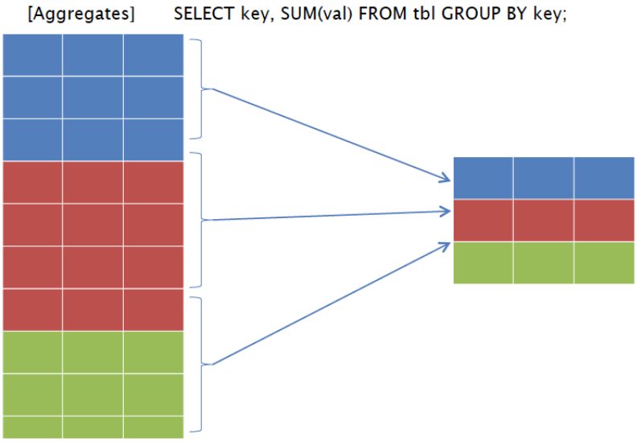
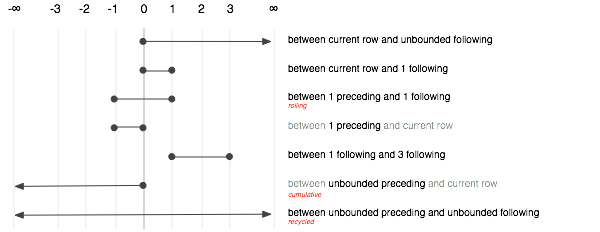
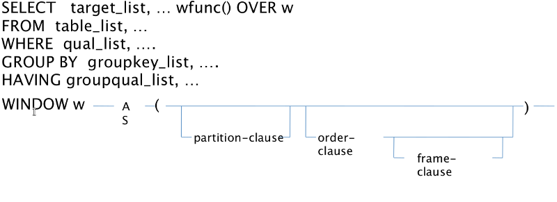

Big data :: Lecture 3
========================================================
author: Adolfo De Unánue T.
date: 4 de marzo, 2015
font-import: http://fonts.googleapis.com/css?family=Risque
font-family: 'Risque'
css: ../css/itam_big_data.css


========================================================
type: exclaim

## Bases de datos


Bases de datos
=========================================================
* Un RDBMS es la solución para datos no tan grandes...
    - Pero mas grandes que MS Excel.
* Adecuada para todas las tareas
    - Pero no es excelente en ninguna.
* Fácil de usar
    - Pocos requerimientos de HW.
    - Soporte en casi todos los lenguajes.
    - Todo el mundo la conoce.
* En realidad, no puede hacer big, big data.

Bases de datos Relacionales
=========================================================

- **Edward F. Codd**
  - Héroes verdaderos, no como *Steve Jobs*.

- Contienen *relaciones* (`tablas`), las cuales tienen un conjunto de *tuplas* (`renglones`), las cuales
mapean *atributos* a valores *atómicos*, los cuales quedan definidos por una *tupla header* mapeado a un *dominio* (`columnas`).

- Originalmente `booleanas`, la implementación actual es `logica trivaluada` (`TRUE`, `FALSE`, `NULL`).


Bases de datos Relacionales
=========================================================

- No son **relacionales** por que las tablas estén relacionadas por campos y restricciones.

- Son **relacionales**  por que están construidas sobre la rama matemática de *álgebra relacional*.

- Aunque en la implementación es simplificada a la rama de *cálculo relacional de tuplas* el cuál se puede convertir en *álgebra relacional*.

========================================================
type: exclaim

## PostgreSQL

¿Por qué PostgreSQL?
========================================================

* Open-source
* Varios tipos de [índices](http://www.postgresql.org/docs/9.3/static/indexes.html)
* `JOIN`s optimizados
    - 5 diferentes tipos de joins
    - Soporta optimizaciones (vía GA) de más de 20 tablas.
* Subqqueries en cualquier cláusula.
* Subqueries anidados.
* Windowing functions
* Geoespacial

¿Por qué PostgreSQL?
========================================================

* Recursive queries
* Soporta `XML`, `JSON`, arreglos...
* Extensibilidad:
    - Bibliotecas externas
    - Lenguajes externos
    - Puedes crear tipos de datos, funciones, agregadores, operadores, etc.
* Foreign Data Wrappers (FDW)
* Creación concurrente de índices
* Listen/Notify
* NOSQL dentro de SQL


¿Dónde está PostgreSQL según el CAP?
======================================================


- Tomado de una página de **IBM**
  - perdí el `URL` :( ...

========================================================
type: exclaim

## PostgreSQL
### Instalación


Instalación
=======================================================

- En distros basadas en `Debian`:

```
> sudo apt-get update
> sudo apt-get -y install python-software-properties
> sudo apt-get install postgresql-9.4 libpq5-dev postgresql-contrib
```

- Accesando a la base

```
> sudo su postgres
postgres$ psql
```
- A partir de aquí habrá que crear usuarios

Instalación
=======================================================
- Por omisión, guardará todo en `/`, detenemos y destruimos:

```
> sudo pg_dropcluster --stop 9.4 main
```

- Creamos uno nuevo

```
> sudo pg_createcluster -d ~/data 9.4 main
```

Instalación
=======================================================

- Ahora PostGIS `:)`

```
> sudo apt-get update
> sudo apt-get install postgis
```

- Dentro de `psql` (un poco más adelante)

```
# \dx+
# create extension postgis;
# create extension postgis_topology;
# create extension fuzzystrmatch;
# create extension postgis_tiger_geocoder;
# \dx+
# select postgis_version();
```

========================================================
type: exclaim

## PostgreSQL
### Tipos de datos

Tipos de datos
========================================================
- `smallint`, `integer`, `bigint`, `numeric`, `float`
  - Nunca usen `money`

- `uuid`

- `boolean`, `char`, `varchar`, `text` ...

- `inet`, `cidr`, `macaddr`

- `date`, `timestamp`, `time`

- Más los que agregan las extensiones

Arreglos
=======================================================

```{sql}
create table cosas (
  id serial not null,
  nombre varchar,
  etiquetas varchar [],
  created_at timestamp,
  updated_at timestamp
);
```

* Insertamos de la siguiente manera:

```{sql}
insert into cosas
values (1, 'Cosa 1', '{"Algo", "Otra cosa"}', now(), now());
```

* Seleccionamos

```{sql}
select unnest(etiquetas) from cosas;
```

Rangos
=======================================================

```{sql}
create table clases (
  salon varchar,
  periodo tsrange
);
```

* Insertamos de la siguiente manera:

```{sql}
insert into clases
values ('Sala de video 2', '[2015-03-04 08:00, 2015-03-04 11:00]');
```

========================================================
type: exclaim

## PostgreSQL
## `psql`


psql
=======================================================

- Es el cliente *par excellence* de PostgreSQL.
  - Algunos prefieren `pgadmin`, no lo veremos en el curso...

- Como he dicho en otras ocasiones, las interfaces de línea de comandos (`CLI`) son las más eficientes
  - Y las mejores para **big data**. Punto.

psql
=======================================================

### Modo interactivo

- `\?` les indica que comandos de `psql` existen
  - Algunos comandos útiles: `\l`, `\connect`, `\d`, `\dt`, `\a`,  `\x`, `\i`, `\o`, `\g`, `\!`, `\pset pager`, `\timing on/off`
- `\help` adelante de una sentencia `SQL` les muestra la ayuda de la sentencia
  - **Ejercicio** Intenten `\help select` y ejecútenlo cada vez que veamos un comando de `SQL` que desconozcan.

psql
=======================================================

### Modo interactivo

- Definir un *alias*
  - `\set eav 'EXPLAIN ANALYZE VERBOSE`

- Otro alias interesante:

```
\set show_slow_queries
'SELECT
  (total_time / 1000 / 60) as total_minutes,
  (total_time/calls) as average_time, query
FROM pg_stat_statements
ORDER BY 1 DESC
LIMIT 100;'
```

psql
=======================================================

### Modo no interactivo

- Para evitar que pregunte la contraseña, creen un archivo `.pgpass` en su `$HOME`
con la siguiente sintaxis:

```
host:port:*:username:password
```

Una línea por cada conexión.


psql
=======================================================

### Modo no interactivo

- Conexión

```
psql -h host -U user -d base_de_datos
```

- Ejecutar un archivo `.sql`

```
psql -f script.sql
```

- Ejecutar un comando `SQL`

```
psql -d base_de_datos -c "SELECT * from pg_tables limit 1;"
```

- **Ejercicio**: Averigua que hace la famosa bandera **axe cutie**: `-Ax -qt` ¿En que circunstancia lo usarías? ¿Y la bandera `-e`?

psql
=======================================================

### Modo no interactivo

- Algunas mejoras (ejecuta un `select * from pg_tables` entre cada uno de los siguientes.)

```{sql}
\pset linestyle unicode  -- Mejora la línea de presentación

\pset border 2  -- Borde a 2 px

\pset pager off  -- Deshabilita el pager
```

- Mejorar el **[`PROMPT1`](http://www.postgresql.org/docs/9.3/static/app-psql.html#APP-PSQL-PROMPTING)**

```
\set PROMPT1 '%[%033[33;1m%]%x%[%033[0m%]%[%033[1m%]%/%[%033[0m%]%R%# '
```

-  Obviamente pueden agregarlo a su **`.psqlrc`**


========================================================
type: exclaim

## PostgreSQL
## Configuración


Configuración
=======================================================

- **`postgres.conf`** Configuración general.
- **`pg_hba.conf`** Controla la seguridad.
- **`pg_ident.conf`** Mapea los usuarios del sistema a usuarios de postgresql.

```
select name, setting
from pg_settings
where category = 'File Locations';
```

```
select name, context, unit, setting, boot_val, reset_val,
from pg_settings
where name in (
'listen_addresses', 'max_connections', 'shared_buffers',
'effective_cache_size', 'work_mem', 'maintenance_work_mem'
)
order by context, name;
```

Configuración
=======================================================

- **`pg_hba.conf`**:

  - Método de autenticación: Usen `md5` para ss usuarios remotos, `ident` para los locales
  - En `connections` la notación es `IPv4 / IPv6` si quieren conexiones remotas, pueden empezar con `0.0.0.0/0` (esto abre todas!).
  - Limiten que el usuario `postgres` y su usuario `dba` sólo se conecten localmente (creen un usuario de `SO` para el `dba`).

Configuración
=======================================================

- **`pg_hba.conf`**:

```
local     all    postgres     peer
local     all      all        md5

...

host      all      all     0.0.0.0/0  md5
```


Administración básica
=======================================================

- Crear usuarios:

```{sql}
create role leonidas login password 'king0fSpart4'
createdb valid until 'infinity';
```

```{sql}
create role dario login password 'persianRuler'
superuser valid until '2020-10-20 03:00:00';
```

- Grupo

```{sql}
create role persians inherit;
```

- Agregando alguien al grupo

```{sql}
grant persians to some_guy_about_to_die;
```

Administración básica
=======================================================

- Crear una base de datos:

```{sql}
create database ufo;

-- Pueden agregar OWNER dueño y TABLESPACE table_space
```

- Esquemas (para organizar la base de datos)

```{sql}
create schema dirty;

-- Podemos agregar un dueño con AUTHORIZATION dueño
```

Administración básica
=======================================================

   **Ejercicio:** Crea los esquemas:
      `"$user", dirty, clean, shameful, playground, output, mining, ml`

- Modifica el `path` de búsqueda

```{sql}
alter database ufo set search_path="$user", dirty, clean, shameful, playground, output, mining, ml;
```

Administración básica
=======================================================

- Permisos en el esquema

```{sql}
grant usage on schema dirty to public;

alter default privileges in schema dirty
grant select, references on tables
  to public;

alter default privileges in schema dirty
grant select, update on sequences
  to public;

alter default privileges in schema dirty
grant execute on functions
  to public;

alter default privileges in schema dirty
grant usage on types
  to public;
```

Administración básica
=======================================================


- Si el esquema ya está poblado:

```{sql}
grant usage on schema clean to public;

grant select, references, trigger
  on all tables in schema clean
    to public;

grant execute on all functions in schema clean to public;
grant select, update on all sequences in schema clean to public;
```

Extensiones
======================================================

- Listar las disponibles

```
select *
from pg_available_extensions
where comment like '%string%' or installed_version is not null
order by name
```

- Es equivalente a `\dx` en `psql`.

- En `psql`: `\dx+ fuzzystrmatch` para obtener más información.


Extensiones
======================================================


- Instalar extensiones

```{sql}
create extension fuzzystrmatch schema mis_extensiones;
```

- Las extensiones se deben de instalar *por base de datos*.

**Ejercicio**: Instalar las siguientes extensiones: `dblink`, `file_fdw`, `fuzzystrmatch`, `hstore`
, `pgcrypto`, `postgres_fdw`, `tablefunc`, `auto_explain`, `cube`, `dict_xsyn`, `pg_trgm`.


Operaciones básicas
=======================================================

* `SELECT`

* `INSERT`

* `UPDATE`

* `DELETE`

Modificadores básicos
=======================================================

* `GROUP BY`

* `ORDER BY`

* `HAVING`

Joins
=======================================================
Tomado desde [aquí](http://giannopoulos.net/wp-content/uploads/2013/05/B)




Agregaciones
======================================================

- Reciben `n` valores regresan `1`.

- **Básicos:** `avg()`, `count(*)`,  `count(expression)`, `max()`, `min()`, `sum()`

- **Estadísticos:** `corr()`, `stdenv()`, `variance()`.
  - También en versión población `_pop` y muestra `_samp`.
  - Los de arriba son alias para `_samp`

- **Lógicos:** `bool_and()`, `bool_or()`.

- `array_agg()`, `json_agg()`, `xmlagg()` <- `:(`


========================================================
type: exclaim

## Algunos trucos...

Generales
======================================================

* *Randomize*

`select * from foo order by random();`

(ver más adelante)


* `::` para *castear*: `select '2013-02-14'::date;`

* La división es entera por omisión: `select 1/10 as wrong, 1::float8/10 as correct;`


Generar queries
=======================================================

- Unir varias tablas con **bulk inserts**

```{sql}
select 'insert into myschema.mynewtable select * from ' || table_schema || '.' || table_name || ';'
from information_schema.tables
where table_schema='myschema' and table_name like 'old%';
```

- Transformar una tabla de *wide* a *long*

```{sql}
select
'insert into output_table (pais, entidad, variable, valor) select pais, entidad, entidad, modelo, "' || column_name::varchar || '", ' || column_name::varchar || ';' as query
from information_schema.columns
where table_name = 'table_name' and table_schema='table_schema';
```
- Generar *queries* para `MongoDB`

```{sql}
select
    'db.foo.findOne({_id: ObjectId("' || _id || '")})'
from foo;
```

Fechas
=======================================================

```{sql}
select
date_trunc('year', '2014-02-25'::date) as year,
date_trunc('month', '2014-02-25'::date) as month,
date_trunc('day', '2014-02-25'::date) as day;
```

```{sql}
select
to_char('2013-02-25'::date, 'YYYY') as year,
to_char('2013-02-25'::date, 'MM-YYYY') as month,
to_char('2013-02-25'::date, 'YYYYMMDD') as day;
```

```{sql}
select
date_part('day', '2013-02-25'::date);
```

Generar secuencias
======================================================

* Ejemplo básico

```{sql}
select * from generate_series(0,100,5);
```

* Usándola con funciones

```{sql}
select avg(val)
from generate_series(0,100,5) as val;
```

* Una serie de fechas

```{sql}
select
current_date + step.i as date_series
from
generate_series(0,14,2) as step(i);
```


"Pivotear" tablas
========================================================

- Como las tablas dinámicas de Excel.

- Usaremos `tablefunc`

```{sql}
CREATE TEMP TABLE t (
  section   text
 ,status    text
 ,ct        integer
);

INSERT INTO t VALUES
 ('A', 'Active', 1), ('A', 'Inactive', 2)
,('B', 'Active', 4), ('B', 'Inactive', 5)
                   , ('C', 'Inactive', 7);
```

```{sql}
SELECT * FROM crosstab(
       'SELECT section, status, ct
        FROM   t
        ORDER  BY 1,2'

      ,$$VALUES ('Active'::text), ('Inactive')$$)
AS ct ("Section" text, "Active" int, "Inactive" int);
```

Estadísticas muy loca
========================================================
- Como **feature engineering**

Suponiendo una tabla así:


user_id | place | type_of_place | money_spended| time
--------|-------|---------------|-------------|------
        |       |               |             |

- Promedio y desviación estandar...

```{sql}
SELECT
    user_id,
    type_of_place,
    avg(money_spended) AS avg,
    stddev(money_spended) AS stddev
FROM

GROUP BY
    user_id,
    type_of_place
```

Estadísticas muy loca
========================================================

- Hora en la que más realiza transacciones

```{sql}
SELECT
    ...
    mode(extract(hour FROM time)) AS mode  -- Add this expression
FROM
    ...
```
Estadísticas muy loca
========================================================

- Top 5 lugares por gasto

```{sql}
SELECT
    ...
    (array_agg(place ORDER BY money_earned DESC))[1:5] AS top5_places
FROM
    ...
```

- ¿Si los queremos ordenados?

```{sql}
(SELECT
    (array_agg(place ORDER BY cnt DESC))[1:5]
FROM
    (SELECT place, count(*) FROM earnings AS t2
     WHERE t2.user_id = earnings.user_id AND t2.type_of_place = earnings.type_of_place
     GROUP BY place) AS s (place, cnt)
) AS top5_places
```


Estadísticas muy loca
========================================================

- ¿Y un histograma de horas en los lugares?


```{sql}
(SELECT
    array_agg(cnt ORDER BY hour DESC)
FROM
    (SELECT extract(hour FROM time), count(*) FROM earnings AS t2
     WHERE t2.user_id = earnings.user_id AND t2.type_of_place = earnings.type_of_place
     GROUP BY 1) AS s (hour, cnt)
) AS hourly_histogram
```


**Ejercicio:** El último query no trae los datos correctos, es necesario usar un `generate_series`
¿Se les ocurre como?

**Ejercicio:** Más adelante veremos que `PostgreSQL` es muy bueno haciendo mucho en un sólo `query` ¿Cómo unirían estos en uno solo?


Tamaños...
============================================================

- Tamaño de la base de datos

```{sql}
SELECT pg_database_size(current_database());
```

- En formato bonito

```{sql}
select pg_size_pretty(pg_database_size(current_database()));
```

- Tamaño de una tabla

```{sql}
select pg_relation_size('libros');
```

Eliminar duplicados
===========================================================

```{sql}
SELECT * FROM libros WHERE ctid NOT IN
(SELECT max(ctid) FROM libros GROUP BY libro) -- ver cuales están duplicadas
```

```{sql}
DELETE FROM libros WHERE ctid NOT IN
(SELECT max(ctid) FROM libros GROUP BY libro);  -- Sólo un campo
```

```{sql}
DELETE FROM libros WHERE ctid NOT IN
(SELECT max(ctid) FROM libros GROUP BY libros.*) ;  -- Línea completa
```

- **ctid** es una columna oculta en todas las tablas de `Postgresql`, y es único para cada renglón.


Ejercicio: Un poco de Text Mining
========================================================

- En un *script* que siempre parta de cero:

- Crea una base de datos: **movies**.

- Crea tres tablas:
  - `genres` (`name` (text UNIQUE), `position` (integer)),
  - `movies` (`movie_id` (serial primary key), `title` (text), `genre` (cube))
  - `actors` (`actor_id` (serial primary key), `name` (text))


Ejercicio: Un poco de Text Mining
========================================================

- Y una tabla **`habtm`**:

```{sql}
  create table movies_actors (
    movie_id integer references movies not null,
    actor_id integer references actors not null,
    unique (movie_id, actor_id)
  );
```
- Índices

```{sql}
create index movies_actors_movie_id on movies_actors (movie_id);
create index movies_actors_actor_id on movies_actors (actor_id);
create index movies_genres_cube on movies using gist (genre);
```


- Carga la información con el script `movies_data.sql`.
  - Obtenido del libro *Seven databases in seven weeks*.

Ejercicio: Un poco de Text Mining
========================================================

- ¿Qué hace lo siguiente?

```{sql}
select title from movies where title ilike 'stardust%';
```

```{sql}
-- Regex
-- ~ operador de matching
-- ! No matching
-- * case insensitive
select count(*) from movies where title !~* '^the.*';
```
- Índice para `regex`

```{sql}
create index movies_title_pattern on movies (lower(title) text_pattern_ops);
-- Alternativas: varchar_pattern_ops, bpchar_pattern_ops, tern_ops, name_pattern_ops
```
- Levenshtein

```{sql}
select movie_id title from movies
where levenshtein(lower(title), lower('a hard day nght')) <= 3;
```

Ejercicio: Un poco de Text Mining
========================================================

-Trigramas

```{sql}
select show_trgm('Avatar');

-- Buscar parecidos simplemente se reduce a contar el número de trigramas que coinciden.

create index movie_title_trigram on movies
using gist (title gist_trgm_ops);

select title
from movies
where title % 'Avatre';

-- Excelentes para user input...
```

-- Metafonemas

```{sql}
select title
from movies NATURAL join movies_actors NATURAL join actors
where metaphone(name, 6) = metaphone('Broos Wils', 6);

-- ¡Me sorprende cada vez que corre!
-- Natural join es un inner join que hace el on en automático.

```

Ejercicio: Un poco de Text Mining
========================================================

- El campo `genre` es un vector multidimensional...

```{sql}
select name,
cube_ur_coord('(0,7,0,0,0,0,0,0,0,7,0,0,0,0,10,0,0,0)', position) as score
FROM genres g
WHERE cube_ur_coord('(0,7,0,0,0,0,0,0,0,7,0,0,0,0,10,0,0,0)', position) > 0;
```

- Cercanas

```{sql}
SELECT *,
cube_distance(genre, '(0,7,0,0,0,0,0,0,0,7,0,0,0,0,10,0,0,0)') dist
FROM movies
ORDER BY dist;
```

Ejercicio: Un poco de Text Mining
========================================================

- Dentro del cubo

```{sql}
SELECT title, cube_distance(genre, '(0,7,0,0,0,0,0,0,0,7,0,0,0,0,10,0,0,0)') dist
FROM movies
WHERE cube_enlarge('(0,7,0,0,0,0,0,0,0,7,0,0,0,0,10,0,0,0)'::cube, 5, 18) @> genre
ORDER BY dist;

-- El operador @> es "contiene"
-- cube_enlarge(cubo, radio, dimensiones): select cube_enlarge('(1,1)', 1, 2)
```


Ejercicio: Un poco de Text Mining
========================================================

**Ejercicio**: Trae todas las películas cercanas a *Apocalypse Now* para recomendárselas a un amigo...

**Ejercicio**: ¿Cómo modificas el código, si tu amigo escribe mal el nombre de la película?


Agregaciones
====================================================

- Películas por actor

```{sql}
select
actors.name,
array_to_string(array_agg(movies.title), ',') as movies
from
actors
natural join movies_actors
natural join movies
group by
actors.name
```

Agregaciones: JSON
====================================================

- Películas por actor (en JSON)

```{sql}
select row_to_json(tabla)
from (
     select actor_id, name,
     (
        select array_to_json(array_agg(row_to_json(jd)))
        from (
             select movie_id, title, genre
             from movies
             natural join movies_actors ma
             where  ma.actor_id = j.actor_id;
        ) jd
     ) as peliculas
     from actors j
) as tabla;
```

========================================================
type: exclaim
## PostgreSQL
## Performance


Capas que afectan el performance
========================================================




Diferentes tipos, diferentes problemas
========================================================
* Webapp

* OLTP

* Dataware-house (DW)
    - Importaciones de datos masivas, pero pocas
    - Años de datos
    - Queries duran horas (o días)
    - 5x - 2000x el RAM disponible

========================================================
type: exclaim
# PostgreSQL Performance
## Hardware


Hardware
========================================================
## CPU,  RAM, I/O, Network

- **DW**: I/O, CPU, RAM
- **OLTP**: Todos
- **Web**: CPU, Network, RAM, .....,.... I/O


CPU
========================================================
type:alert


# **Un core, un query**


RAM
========================================================
* WebApp
    - BD en `shared_buffers` -> 6x BD

* OLTP
    - Toda la BD a caché  -> 2x-3x el tamaño de la BD

* DW
    - ¿Cuál es el tamaño de los `sorts` y los `aggregates`?


I/O
========================================================
* ¿Habrá problemas de I/O?
    - ¿Muchos inserts, updates? -> Limitado por el log de transacciones
    - ¿DB es más grande que 3x el RAM? -> Cada query sufrirá

* Solución: Discos


* ¿Cargas masivas? -> Discos


Árbol de decisión
========================================================



Tips finales
========================================================
* La calidad importa.

* Prueben, prueben y vuelvan a probar.

* Nunca le crean a su vendedor o a su sysadmin.

* Prueben... (en serio)


========================================================
type: exclaim
# PostgreSQL: Performance
## Sistema operativo


Divide et impera
========================================================
* Poner en su propia partición o disco el log de transacciones
    - `pg_xlog`
    - 10-50% más rápido.

    ```
    # /<mountpoint1>/.../pg_xlog donde están los WAL
    # /<mountpoint2>/.../pg_xlog donde quieres que están (en otro disco)

    > /etc/init.d/postgresql stop
    > mkdir -p /<mountpoint2>/.../pg_xlog
    > mv /<mountpoint1>/.../pg_xlog/* /<mountpoint2>/.../pg_xlog/
    > rmdir /<mountpoint1>/.../pg_xlog
    > ln -s /<mountpoint2>/.../pg_xlog/ /<mountpoint1>/.../pg_xlog
    > /etc/init.d/postgresql start
    ```


Divide et impera
========================================================
* `Tablespaces` en sus propios discos
    - Tablas grandes
    - Tablas e índices más usados

    ```{sql}
     create tablespace bigdata-space owner su_nombre_de_usuario location 'path_a_/bigdata-disk';
    ```
* ¿Y si ahora quiero cambiar de lugar una tabla ya existente?

    ```{sql}
    alter table tablota set tablespace = 'newstorage';
    ```


* Cuidado: La BD se bloquea durante esta transacción.


GNU/Linux: Tipos de `filesystem`
========================================================
* OLTP -> `XFS` ó `JFS`

* DW -> `ext4` sin "loggeo"  (a la hora de crear)

    ```
    -data=writeback, noatime, nodiratime
    ```
* Ver
  - [Improving MetaData Performance of the Ext4 Journaling Device](http://www.linux-mag.com/id/7642/).
  - [SSDOptimization](https://wiki.debian.org/SSDOptimization)
  - [Hadoop Operations](http://my.safaribooksonline.com/book/databases/hadoop/9781449327279/4dot-planning-a-hadoop-cluster/id2548524)

GNU/Linux: Tamaño de las páginas
========================================================

* Incrementar (súper importante) `shmmax`,  `shmall`  en el kernel

    ```{shell}
    #!/bin/bash

    page_size=`getconf PAGE_SIZE`
    phys_pages=`getconf _PHYS_PAGES`
    shmall=`expr $phys_pages / 2`
    shmmax=`expr $shmall \* $page_size`
    echo kernel.shmmax=$shmmax
    echo kernel.shmall=$shmall
    ```

* Modificarlos permanentemente depende de su versión de kernel y distibución...

* Un kernel nuevo (algo menor a `2.6.9` es malísimo...)


Windows OS
========================================================
type:alert

# ¿Están bromeando verdad?


Por último...
========================================================
* ¡Monitoreen todo!
    - CPU
    - I/O
    - Network
    - Espacio en disco
    - Swap
    - RAM

========================================================
type: exclaim
# PostgreSQL: Performance
## postgres.conf


Modificar, modificar
========================================================
* Modificar: `/etc/postgresql/9.x/postgres.conf`
  * `shared_buffers` por lo menos un 1/4 de RAM
      - Si tienes más de 32 Gb `->` 8Gb
  * `wal_buffers=16Mb`
  * `work_mem` por lo menos 1Gb
  * `maintenance_work_mem` por lo menos 1Gb
  * `temp_buffers=16Mb`

Modificar, modificar
========================================================
- `effective_cache_size` 3/4 de la RAM disponible...
- `default_statistics_target` 1000
      - Estadísticas por columnas es aún más rápido
- `autovacuum=off`,  `vacuum_cost_delay=off`
      - Hacerlo a mano e incluir `analyze`

- Checkpoints

```
checkpoint_completion_target = 0.9
checkpoint_timeout = 10m-30m # Depends on restart time
checkpoint_segments = 32 # To start.
```


Modificar, modificar
========================================================

- `random_page_cost` 3.0 para un arreglo `RAID10`, 2.0 para un `SAN` 1.1 para `Amazon EBS`.

  * [Docs](http://wiki.postgresql.org/wiki/Tuning_Your_PostgreSQL_Server)

========================================================
type: exclaim
# PostgreSQL: Performance
## Application layer


App
========================================================
* Al igual que en el código, no optimicen al inicio...


Indexing
========================================================
* Indexing
    - foreign keys
    - `WHERE` comunes
    - Agregados de columnas comunes
    - expresiones
    - `full text`
    - `partial`
* Los índices afectan muchísimo los `updates`, `deletes`
    - No tiene caso hacerlo para tablas pequeñas


Indexing
========================================================
*  `pg_stat_user_indexes`
    - Índices no usados (ya que muestra el uso de los índices)

*  `pg_stat_user_tables`
    - Escaneos secuenciales -> candidatos para índices
    - Muchos Updates/Deletes  -> Borrar índices (quizá)

* [Docs](http://www.postgresql.org/docs/9.2/static/monitoring-stats.html)

Divide et impera
========================================================

## (Reloaded)

- **Particionado vertical**
  - Tablas con muchas columnas en varias tablas
  - ¿Estás mezclando atributos que se accesan mucho con aquellos que lo hacen poco?
  - ¿Mezclando atributos estáticos con aquellos que se modifican mucho?

Divide et impera
========================================================

## (Reloaded)

- **Particionado horizontal**
  - Tablas con muchas filas en varias tablas


Partitioning
========================================================
* Excelente para:
    - Datos históricos
    - Tablas muy grandes
    - Performance de `inserts`
    - Menos de 300 particiones

Partitioning
========================================================
* Está basado en `table inheritance` y  `constraint exclusion`:
    - `triggers`o `RULES` se encargan de las inserciones y actualizaciones.
    - Las constricciones definen los rangos para la tabla.

* Consideraciones:
    - Un delete puede matar al servirdor (literal)
    - Cada query debe usar la llave de particionado.
    - Hay que precrearlas


Partitioning
========================================================
```{sql}
CREATE TABLE ufo_2001 (
CONSTRAINT partition_date_range
CHECK (report_date >=   '2001-01-01'
AND report_date <= '2001-12-31 23:59:59')
) INHERITS ( ufo );
```


Partitioning
========================================================
```{sql}
CREATE FUNCTION ufo_insert ()
RETURNS trigger
LANGUAGE plpgsql AS $f$
BEGIN
CASE WHEN NEW.report_date < '1989-01-01'
THEN INSERT INTO ufo_1988 VALUES (NEW.*);
WHEN ufo_date < '1990-01-01'
THEN INSERT INTO ufo_1989 VALUES (NEW.*);
...
...
ELSE
INSERT INTO ufo_overflow VALUES (NEW.*);
END CASE;
RETURN NULL;
END;$f$;
```


Partitioning
========================================================
```{sql}
CREATE TRIGGER ufo_insert BEFORE INSERT ON ufo
FOR EACH ROW EXECUTE PROCEDURE ufo_insert();
```


Queries
========================================================
* Hagan mucho en cada query
    - PostgreSQL es muy bueno con queries grandes
    - (y no tan bueno con muchos queries pequeños).

* Asegurar que cuando usen una llave o índice los tipos coincidan (o no se usará el índice).

* Eviten búsquedas de texto como `LIKE %Hola%`


Queries: EXPLAIN ANALYZE
========================================================

```{sql}
explain [analyze]
select * from ...
```

* Es un  árbol invertido -> Hay que buscar en el nivel más profundo para ver donde ocurre el problema.

* Leerlo es una arte...

Queries: EXPLAIN ANALYZE
========================================================

```{sql}
postgres=# explain select * from clases;
                        QUERY PLAN
----------------------------------------------------------
 Seq Scan on clases  (cost=0.00..18.60 rows=860 width=64)
(1 row)
```

```
postgres=# explain analyze select * from clases;
                                             QUERY PLAN
----------------------------------------------------------------------------------------------------
 Seq Scan on clases  (cost=0.00..18.60 rows=860 width=64) (actual time=0.005..0.006 rows=1 loops=1)
 Planning time: 0.026 ms
 Execution time: 0.018 ms
(3 rows)
```


Queries: EXPLAIN ANALYZE
========================================================


* Buscar malos conteos, escaneos secuenciales, loops enormes, etc.

- Ve en la carpeta `docs`, el archivo `optimizer.pdf` para una introducción al tema.

- Activa la extensión `auto_explain` para que puedas estar optimizando mientras ejecutas *queries*.


Tablespaces
========================================================
* Paraleliza el acceso.
    - Tu  tabla más grande a un tablespace.
    - Sus índices a otro.
* Tablas temporales a un tablespace temporal.
* Los joins muévelos a un SSD (si se puede),
* Y al migrar, una tabla a la vez.

========================================================
type: exclaim

# PostgreSQL: Performance
## ETL


ETL
========================================================
* Extracción, transformación y carga

* Extracción, carga y transformación (ELT)
    - PostgreSQL es muy bueno en ELT.

* Incluye:
    - Limpiar la basura
    - Partir atributos
    - Normalizar dimensiones
    - Vistas materializadas, índices.

* Cargar en masa, en paralelo y olvídense de los `update`s.


`INSERT`s
========================================================
* "Bulk inserts"

```{sql}
UPDATE  mytable
SET     s.s_start = 1
FROM    (
    VALUES
    (value1),
    (value2),
    …
) q
WHERE   …
```


```{sql}
INSERT INTO mytable (mykey, mytext, myint)
VALUES
(1, 'text1', 11),
(2, 'text2', 22),
```


`INSERT`s
========================================================
```{sql}
INSERT INTO bar (a, b, c)
SELECT d, e, f FROM foo
WHERE  foo.d not in (SELECT a FROM bar);
```

```{sql}
UPDATE bar
SET    b = foo.e, c = foo.f
FROM   (SELECT d, e, f FROM foo) AS foo
WHERE  a = foo.d;
```


`INSERT`s
========================================================
* Crea y carga las tablas en una sola transacción (`SELECT INTO`, `CREATE TABLE AS`)

* Agrega los índices al final

* Inserciones en paralelo
      -pero no más que los CPUs que dispones


`COPY`
========================================================
* Dos versiones en  `psql` y en `SQL`:
    - `COPY`  en el servidor
    - `\copy` local

* 3x-5x veces más rápido que los `insert`s.

* Tienes que conocer la estructura con antelación (si no truena a la mitad y `rollback` :(  ).

* Trata de no hacer que la base "pagine".
    - Divide los archivos según el tamaño de la página del SO.
    - Usa `split` y sus amigos.


`COPY`
========================================================
* En `SQL`

```{sql}
COPY airports
FROM
'airports.csv'
with
delimiter ',' nulls as 'NA' header csv;
```

* Usando `psql`

```{sql}
\copy airports
FROM
'airports.csv' with
delimiter ',' header csv;
```


`COPY`
========================================================

* **Versión segura**:

```
\copy airports(iata, airport, city, state, country, lat, long)
from 'airports.csv' with delimiter ',' header csv
```

COPY: Archivos gigantes
===============================================================

- Si tengo un archivo gigante y quiero aprovechar la memoria de manera eficiente y mis CPUs

```
cat archivote.psv | parallel --pipe --block 500M ./carga_postgres.sh

# Si no lee de stdin y usa archivos...

cat archivote.psv | parallel --pipe --block 500M "cat > {#}; ./carga_postgres.sh {#}"

# Salvando el avance...
cat archivote.psv | parallel --pipe --block 500M --joblog my_log --resume-failed "cat > {#}; ./carga_postgres.sh {#}"
```


COPY: Archivos gigantes
===============================================================

- Es  mejor usar la herramienta [**`GNU sql`**](http://www.gnu.org/software/parallel/sql.html)
  - Viene incluida dentro de `GNU parallel`

```
cat archivote.psv | parallel --pipe --block 500M sql pg://user:pass@host/db
```

Esta versión no usa archivos temporales , todo pasa por los *pipes* (memoria).

`FDW`: Foreign Data Wrappers
========================================================
* Soporta: Oracle, MySQL, ODBC, NoSQL, Archivos, twitter, ldap, www, etc.
    - [Docs](http://wiki.postgresql.org/wiki/Foreign_data_wrappers)

```{sql}
CREATE EXTENSION file_fdw;  -- Habilitamos la extensión
CREATE SERVER file_server FOREIGN DATA WRAPPER file_fdw;  -- Una formalidad
```

```{sql}
CREATE FOREIGN TABLE carriers
( Code varchar, Description varchar )
SERVER file_server
OPTIONS (format 'csv', delimiter ',', filename 'carriers.csv', header 'true', null '');
```


FDW
========================================================
```{sql}
ALTER FOREIGN TABLE carriers OPTIONS ( SET filename '../carriers.csv' );
-- Cambiamos la localización del archivo
```

* ¡Y es una tabla cualquiera!
    - Ver ejemplo [aquí](http://www.postgresonline.com/journal/archives/250-File-FDW-Family-Part-1-file_fdw.html) para tratar fechas.

**Ejercicio**: Creen otra base de datos, y usen el `postgres_fdw` para accesarlo, ejecuten un query con ambas bases de datos. (Los pasos son muy similares).

Tablas temporales
========================================================
* Yo las uso principalmente dentro de funciones (como pasos intermedios)

```{sql}
CREATE TEMPORARY TABLE
ON COMMIT DROP  -- Comenten esto o desaparecerá
rita_rollup AS
SELECT tail_num, year, month, sum(distance) as distancia_recorrida,
array_agg(origin || '->' || dest) as itinerario
FROM rita
WHERE year BETWEEN '1988'
AND '2001'
GROUP BY tail_num, year, month;
```


`Unlogged tables`
========================================================
* Hasta 40% más rápidas (no usan el wal)

```{sql}
CREATE UNLOGGED TABLE
cleaned_rita
AS SELECT ...
FROM dirty_rita,
WHERE ...
```
* Mucho cuidado, se cae el servidor y desaparece la tabla
    - Ya me pasó :( 6 Tb perdidos


Tips
========================================================
* Bulk insert a una nueva tabla en lugar de actualizar la existente.
    - Sin miedo, de verdad

* Actualiza todas la columnas de un sólo golpe, no una por una.

* Usa vistas y funciones para simplificar.

* ¡Insertar en la tabla final limpia es el último paso!
    - ¡No le hagas `updates`!


Tips
=======================================================

- *Loggea*, siempre, todo

- En **`postgres.conf`**
```
log_destination = 'csvlog'
log_directory = 'pg_log'
logging_collector = on
log_filename = 'postgres-%Y-%m-%d_%H%M%S'
log_rotation_age = 1d
log_rotation_size = 1GB
log_min_duration_statement = 250ms
log_checkpoints = on
log_connections = on
log_disconnections = on
log_lock_waits = on
log_temp_files = 0
```


Tips
=======================================================

- Sólo ejecuta la base de datos en el host.

- Desactiva el `OOM Killer` (GNU/Linux)
  - Olvidarme de esto fué lo que hizo que perdiera mis 6 Tb :(
  - Depende de su distro

- **Nunca** mezcles una base de datos operativa con el **DW**.

- Si tienes una tabla que tiene partes que se actualizan mucho y otras que se actualizan poco `->` divide la tabla en dos.

Tips
========================================================

- `vacuum` a mano, regularmente (¿Recuerdan que lo desactivamos?)

- Es posible correrlo en paralelo

```
sql -n --list-tables pg://user:pass@host/db  | parallel -j0 -r --colsep '\|' sql pg://user:pass@host/db vacuum full verbose {2}
```

- La misma idea sirve para varios *queries* en paralelo.

Tarea
========================================================
* Cargar los archivos ufo de manera sucia
* Configurar su `postgres.conf`
* Crear un particionado para ufo por año.
* Cargar  todas las tablas auxiliares como fdw.
* Limpiar ufo en la BD.
* Exportar a archivo CSV (con `copy`).

¿Cómo cargar masivamente?
========================================================
* Dentro del archivo `cargar_ufo.sh`

```{shell}
# Dividimos el archivo rita.csv
split -l 1000000 rita.csv rita_

for f in rita_*
do
# Yo cambiaría el encoding de cada archivo con iconv antes de cargarlos
sql="\copy dirty_rita from $f with header csv;";
echo $sql
echo "-"
date
# Ojalá hayan configurado .pgpass
psql -d bigdata_db -U usuario -c "$sql"
echo "*******************************"
date
done

# Borramos
# rm rita_*
```

- ¿Cómo hacerlo en paralelo?

Van a fallar las subidas...
========================================================
* Pero no todas... (esa es la idea, avanzar)

* Los archivos que no se carguen, observen el error y quiten las líneas con `sed`.
    - Guarden las líneas con error a una archivo

* Quizá sea bueno guardar la salida del script a un archivo con `>` .

========================================================
type: exclaim

## PostgreSQL: Analítica


Agregados regulares
========================================================



Windowing functions
========================================================
* Provee acceso a un conjunto de renglones, desde el renglón actual.


Componentes de la ventana
========================================================
* Una partición
    - Especificado por `PARTITION`.
    - Nunca cambia
    - Puede contener un `frame`.


Componentes de la ventana
========================================================
* Un marco (frame)
    - Especificado por `ORDER BY`
    - Se mueve en la partición.
    - Pero sólo dentro de una partición.


Componentes de la ventana
========================================================
* Función
    - Algunas toman valores en la partición, otras en el frame.


Partition
========================================================


Frame
========================================================


Frame
=======================================================


Window
========================================================



Todo junto
========================================================
```{sql}
  select ...
  window_function()
  over (
  partition by
  order by ...
  )
  from ...
  where ...
```


Windowing functions: Generalidades
========================================================
* Regresa un valor por cada renglón.

* El valor de retorno es calculado en los renglones de la ventana.

*  `OVER()` convierte funciones normales en `window function`. Esto significa que cuando PostgreSQL ve una `window function` revisa todos los registros que satisfacen el `WHERE`, hace la agregación y devuelve la salida como parte del registro actual.

* `PARTITION BY` le indica a PostgreSQL que subdivida la ventana. La agregación se hace en la subventana.


Windowing functions: Generalidades
========================================================
* `ORDER BY` ordena las filas, las `window functions` trabajan entre el renglón actual y el ultimo de la ventana.

* Se pueden combinar `ORDER BY`  y  `PARTITION BY`. Reinicia el ordenamiento por cada ventana.

* A diferencia de ORACLE, PostgreSQL permite usar como `window function` los agregados que ustedes creen.

* Pueden tener varias particiones, no se preocupen...


Lista de funciones
========================================================
* `row_number()` -> Regresa el número de la fila actual.
* `rank()` -> Rango de la fila actual con gaps.
* `dense_rank()` -> Lo mismo pero sin gap.
* `percent_rank()` -> Rango relativo.
* `cume_dist()` -> Rango relativo.
* `ntile()` ->

Lista de funciones
========================================================
* `lag()` -> Regresa el valor de la fila anterior (partición).
* `lead()` -> Regresa el valor de la fila siguiente (partición).
* `first_value()` -> Regresa el primer valor del marco.
* `last_value()` -> Regresa el último valor del marco.
* `nth_value()` -> Regresa el n-ésimo valor del marco.


Agregados y acumuladores
========================================================
### Agregados
* Regresa el mismo valor  para todo el marco.
    - `sum`, `avg`, `max`, etc,
    - Se pueden checar desde `psql`, con   `\da[S+]`

```{sql}
select col, sum(col) over() from tabla;
```


Agregados y acumuladores
========================================================
### Acumulados

* Regresa diferentes valores a lo largo del marco.

```{sql}
select carrier, tail_num,
air_time,
sum(air_time) over (
  partition by carrier, tail_num
  order by flight_date
  rows between unbounded preceding
  and current row
  ) as acumulado,
sum(air_time) over (
  partition by carrier, tail_num
  ) as total
from rita
order by carrier
```

Agregar una función de agregación
========================================================

```
CREATE OR REPLACE FUNCTION _final_median(anyarray)
RETURNS float8 as
$$
WITH q AS
(
  SELECT val
  FROM unnest($1) val
  WHERE VAL is not null
  ORDER BY 1
),
cnt AS
(
  SELECT COUNT(*) AS c FROM q
)

SELECT AVG(val)::float8
FROM
(
SELECT val FROM q
LIMIT 2 - MOD((SELECT c FROM cnt), 2)
OFFSET GREATEST(CEIL((SELECT c FROM cnt) / 2.0) - 1, 0)
) q2;
$$
LANGUAGE sql IMMUTABLE;
)
```

```
CREATE AGGREGATE median(anyelement)
(
SFUNC = array_append,
STYPE = anyarray,
FINALFUNC = _final_median,
INITCOND= '{}'
);
```

```
select median(score), avg(score)
from game_results;
```

Tarea
========================================================
* En la base de datos: RITA
    - ¿Primer vuelo de cada aerolínea? ¿Primer vuelo de cada avión?
    - ¿Vuelos fantasmas? (Por favor pregúnten que es un vuelo fantasma)
    - ¿Promedio de retraso por avión, por mes, por año?
    - ¿Los vuelos mas largos tienen más retrasos?
    - ¿Cuál aerolínea tiene más kilómetros, más vuelos, más destinos?
    - ¿Km por aerolínea, ciudad, y diferencia respecto al promedio de km?
    - ¿Cómo podrían identificar un hub?

Tarea
========================================================

  - Número de retrasos por aerolína, ¿Quién es la que más se retrasa? (`row_num`, `rank`, ...)
  - Días con retraso ¿Qué días?¿Qué horas?
  - ¿Hay un número de vuelo de mala suerte?¿De avión?
  - ¿Serie de tiempo (diaria) por aerolínea?
  - Distancia recorrida por carrier ¿Tiempo de vuelo?
  - ¿Cómo obtener accidentes?


========================================================
type: exclaim

# **Intermezzo**


Grafos
========================================================


- En una `RDBMS` los grafos se guardan como *listas de adyacencia*

- **Nodos**

```{sql}
create table nodes (
id integer primary key,
name varchar,
feature_1 varchar,
feature_2 varchar,
...
)
```

Grafos
========================================================

- **Edges**

```{sql}
create table edges (
a integer not null references nodes(id)
on update cascade
on delete cascade,
b integer not null references nodes(id)
on update cascade
on delete cascade,
primary key(a,b)
);
```

- **Índices**

```{sql}
create index a_idx on edges(a);
create index b_idx on edges(b);
```

- Otros

```{sql}
-- - Si el grafo no es direccionado
create unique index pair_unique_idx
on edges (least(a,b), greatest(a,b));

-- Sin auto bucles
alter table edges add constraint
no_auto_bucles_chk check (a <> b);

```

Tarea
========================================================

## **Ejercicio**

- Modificar el código:
    - Nodos: ciudades; atributos del nodo: ¿aerolíneas? / ¿principal aerolínea?
    - Edges: conexiones

- Crear estas tablas


Árboles
========================================================

```{sql}

create table arbol (
  id integer not null,
  parent_id integer references tree(id),
--  feature_1 varchar,
--  feature_2 integer,
--  ...
  unique(id, parent_id)
);

-- Insertamos

insert into arbol(id, parent_id)
values(1, NULL), /* Root */
(2,1), (3,1), (4,1),
(5,2), (6,2), (7,2), (8,3),
(9,3), (10,4), (11.5), (12,5), (13, 6),
(14,7), (15, 8);


```


=========================================================
type:exclaim

# **CTEs**

CTEs
========================================================
* `CTE` = **Common Table Expression**

* Es un `query` se puede usar en un `query` más grande.

* Hay tres tipos:
    - Estándar, no recursivo, no-escribible CTE.
    - Escribible CTE, puede incluir `INSERT`s, `UPDATE`s.
    - Recursivos.


CTE estándar
========================================================
```{sql}
with cancelaciones_ciudad as (
select origin as ciudad, cancellation_code as razon, count(*) as conteo
where cancelled is true
from rita
group by origin, cancellation_code
)


select ciudad, max(conteo) over(partition by ciudad)
from cancelacones_ciudad;
```


* ¿Qué hace esté query?
    - Modificarlo para que muestre la ciudad y su principal razón de cancelación.
    - ¿Hay algún patrón?


CTEs escribibles
========================================================
* Se pueden usar para reparticionar las tablas, por ejemplo extraer un carrier

```{sql}
-- ¡NO EJECUTAR!
with
aa_flights_1 as (delete from only rita where carrier = 'AA' returning *),
aa_flights_2 as (insert into rita_AA select * from aa_flights)
select min(flight_date), max(flight_date), count(*) from aa_flights_1;
```


CTEs recursivos
========================================================
* Secuencias:

```{sql}
with recursive seq(n) as (
-- término no recursivo
select 1 as n
union all

-- término recursivo
select n+1
from seq
where n < 100
)

select n from seq
```

* Dos equipos: Creen una serie de fibonacci, factorial


CTEs recursivos
========================================================
## **Árboles**

- Simple

```{sql}
with recursive t as (
select *
from arbol
where parent_id is null  /* No recursivo */
union all
select e1.*   /*Recursivo*/
from arbol as e1
join t as e2
on e1.parent_id = e2.id
)

select *
from t
order by id
```


CTEs recursivos
========================================================
## **Árboles**

```{sql}
with recursive t(node, path) as (
-- Inicialización
select id, array[id] from arbol where parent_id is null

union all
    select e1.id, e2.path || array[e1.id]    /* Recursión */
    from arbol as e1 join t as e2 on (e1.parent_id = e2.node)
    where array[id] not in (e2.path)  /* Condición de fin */
)

select
  case when array_upper(path,1) > 1 then '+-' else '' end ||
  repeat('--', array_upper(path, 1)-2) ||
  node as "Branch" /* Despliegue */
from t
order by path;
```


CTEs recursivos
========================================================
## **Árboles**

- Con `path`

```{sql}
with recursive t as (
  select *,
  1 as lvl,
  cast(id as text) as tree,
  id || '.' as path
  from arbol
  where parent_id is null

  union all

  select e1.*, e2.lvl + 1 as lvl,
  lpad(e1.id::text, lvl*2, ' ') as tree,
  e2.path || e1.id || '.' as path
  from arbol as e1
  join t as e2
  on e1.parent_id = e2.id
)

select * from t
order by path;
```

CTEs recursivos
========================================================
## **Transitive Closure**

```{sql}
-- Suponiendo que existe una tabla nodes y edges...
with recursive transitive_closure (a, b, distance, path_string) as
(
select a, b, 1 as distance,
'.' || a || '.' || b || '.' as path_string
from edges
union all
select tc.a, e.b, tc.distance+1, tc.path_string || e.b || '.' as path_string
from edges as e
join transitive_closure as tc
on e.a = tc.b
where tc.path_string not like '%.' || e.b || '.%'
)
select * from transitive_closure
order by a,b
;
```


Ejercicio:
========================================================

* Posibles rutas...
    - Modificar el ejemplo anterior para obtener las posibles rutas entre dos ciudades
    - Crear una función

* Otras cosas interesantes:
    - Grados de separación entre nodos (¿Small world networks?)
    - Nodos en común
    - ¿Cómo están conectados?
    - Características en común
    - Travelling Salesman Problem


=========================================================
type: exclaim

# **Misceláneos**

Vistas materializadas
========================================================
```{sql}
CREATE OR REPLACE FUNCTION mv_support.create_matview(name, name)
  RETURNS void AS
$BODY$
 DECLARE
     matview ALIAS FOR $1;
     view_name ALIAS FOR $2;
     entry mv_support.matviews%ROWTYPE;
 BEGIN
     SELECT * INTO entry FROM mv_support.matviews WHERE mv_name = matview;
     IF FOUND THEN
         RAISE EXCEPTION 'Materialized view ''%'' ya existe.',
           matview;
     END IF;

     -- continua...
```


```{sql}
     -- continua...

     EXECUTE 'REVOKE ALL ON ' || view_name || ' FROM PUBLIC';
     EXECUTE 'GRANT SELECT ON ' || view_name || ' TO PUBLIC';
     EXECUTE 'CREATE TABLE ' || matview || ' AS SELECT * FROM ' || view_name;
     EXECUTE 'REVOKE ALL ON ' || matview || ' FROM PUBLIC';
     EXECUTE 'GRANT SELECT ON ' || matview || ' TO PUBLIC';
     INSERT INTO mv_support.matviews (mv_name, v_name, last_refresh)
       VALUES (matview, view_name, CURRENT_TIMESTAMP);
     RETURN;
 END
 $BODY$
  LANGUAGE plpgsql
```


Vistas materializadas
========================================================
```{sql}
CREATE OR REPLACE FUNCTION mv_support.drop_matview(name)
  RETURNS void AS
$BODY$
 DECLARE
     matview ALIAS FOR $1;
     entry mv_support.matviews%ROWTYPE;
 BEGIN
     SELECT * INTO entry FROM mv_support.matviews WHERE mv_name = matview;
     IF NOT FOUND THEN
         RAISE EXCEPTION 'Materialized view % no existe.', matview;
     END IF;
     EXECUTE 'DROP TABLE ' || matview;
     DELETE FROM mv_support.matviews WHERE mv_name=matview;
     RETURN;
 END
 $BODY$
  LANGUAGE plpgsql
```


Vistas materializadas
========================================================
```{sql}
CREATE OR REPLACE FUNCTION mv_support.refresh_matview(name)
  RETURNS void AS
$BODY$
 DECLARE
     matview ALIAS FOR $1;
     entry mv_support.matviews%ROWTYPE;
 BEGIN
     SELECT * INTO entry FROM mv_support.matviews WHERE mv_name = matview;
     IF NOT FOUND THEN
         RAISE EXCEPTION 'Materialized view % no existe.', matview;
     END IF;
    EXECUTE 'DELETE FROM ' || matview;
    EXECUTE 'INSERT INTO ' || matview || ' SELECT * FROM ' || entry.v_name;
    UPDATE mv_support.matviews
        SET last_refresh=CURRENT_TIMESTAMP
        WHERE mv_name=matview;
    RETURN;
END
$BODY$
LANGUAGE plpgsql
```


Muestreo
========================================================
* Esta función asume que los id de transacciones son densos y ordenamos en el tiempo
* Obtenido de [Best way to select random rows PostgreSQL](http://stackoverflow.com/questions/8674718/best-way-to-select-random-rows-postgresql)


```{sql}
-- Obtener estimados:
-- SELECT count(*) AS check_count,min(id)  AS min_id,max(id)
-- AS max_id,max(id) - min(id) AS min_id_span FROM bigtbl
WITH params AS (
    SELECT 1       AS min_id        -- minimum id <= currently min id
          ,5100000 AS id_span       -- beyond max id (max_id - min_id + buffer)
    )

    --continua
```


Muestreo
========================================================
```{sql}
-- continua

SELECT *
FROM  (
    SELECT p.min_id + floor(random() * p.id_span)::integer AS id
    FROM   params p
          ,generate_series(1, 1100) g
    GROUP  BY 1                     -- trim duplicates
    ) r
JOIN   bigtbl USING (id)
LIMIT  1000;
```

Tarea
=======================================================

* Rescribir con una CTE
  - Ejercicio de **Estadística muy loca**
  - Muestreo

========================================================
type: exclaim

## PostgreSQL
# **`R`**

PostgreSQL y R
========================================================

## **`RPostgreSQL`**

- La forma más directa es `RPostgreSQL`.

- Hereda del paquete `DBI`.

- No soporta conexiones con `SSL`.
  - Adios *Heroku*

- Modo de empleo: Ejecutas *queries*, obtienes `data.frames`, los manipulas en `R`, escribes las tablas de resultado.


PostgreSQL y R
========================================================

## **`sqldf`**

- Por default tratará de usar la base de datos `test`, con el usuario `postgres` en `localhost`.


```r
options(sqldf.RPostgreSQL.user = "postgres",
  sqldf.RPostgreSQL.password = "postgres",
  sqldf.RPostgreSQL.dbname = "test",
  sqldf.RPostgreSQL.host = "localhost",
  sqldf.RPostgreSQL.port = 5432)

ds <- # Crea un data.frame

library(RPostgreSQL)
library(sqldf) # Automáticamente usará PostgreSQL

sqldf("select count(*) from ds")

# El driver de PostgreSQL permite funciones analíticas
sqldf('select *, rank() over (partition by ... order by ...) from ds order by ...')
```


PostgreSQL y R
========================================================
## **`dplyr`**


```r
tabla_postgres <- tbl(src_postgres(dbname=..., host=..., port=..., user=..., password=...))

# PostgreSQL soporta todas las funciones analíticas
# row_number(), min_rank(), dense_rank(), cume_dist(), percent_rank(). ntile()
# lead(), lag()
# cumsum(), cummin(), cummax(), cumall(), cumany(), cummean()
op1 <- group_by(tabla_postgres, var1, var2)

op2 <- filter(op1, var4 == min(var4), var4 == max(var4))

op3 <- mutate(op1, rank = rank(desc(var4)))

# etc, etc
```

Tarea
========================================================

- Generar un reporte en `R`, usando `dplyr`/`sqldf` donde se reproduzcan al menos **cinco** de las peticiones mencionadas anteriormente para  **`RITA`**.

========================================================
type:exclaim

# Bibliografía


Bibliografía
========================================================
* You Can Do That Without Perl?, PGCon2009, 21-22 May 2009 Ottawa
* Really Big Elephants Data Warehousing with PostgreSQL, MySQL User Conference 2011
* Data Warehousing 101 Everything you never wanted to know about big databases but were forced to find out anyway, Open Source Bridge 2011
* PostgreSQL: Up and Running, Regina Obe and Leo Hsu, O'Reilly, 2012.
* [Trees and more with postgreSQL](http://www.slideshare.net/PerconaPerformance/trees-and-more-with-postgre-s-q-l)
* [Graphs in database: RDBMs in the social network age](http://www.slideshare.net/quipo/rdbms-in-the-social-networks-age)

